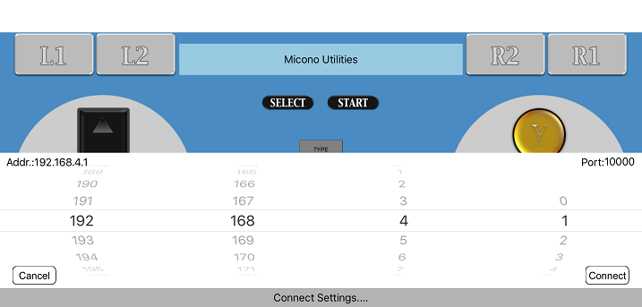
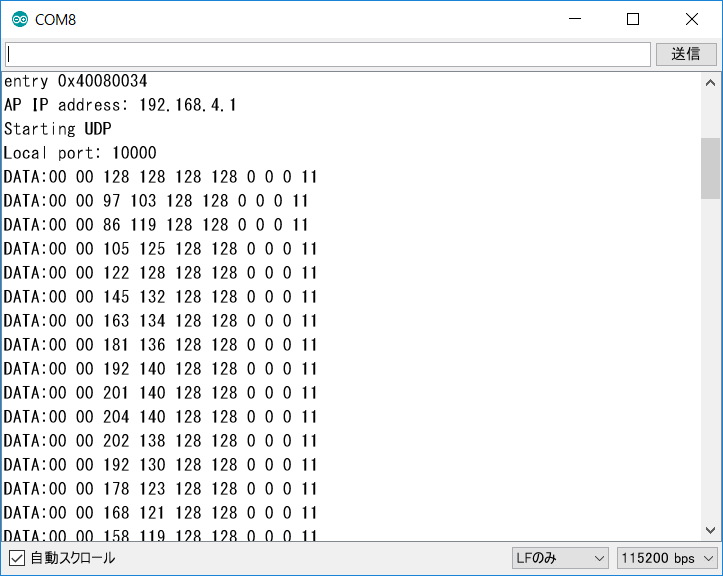

# ESP32_RCWController_Test

ESP32/ESP-WROOM-32とRCWControllerを接続するテストプログラムです。 
RCWControllerは、Michio Onoさん作成のiOSで動作するゲームパッド風インターフェイスを持ったコントローラーアプリです。

### 必要な物 ###
* ESP32/ESP-WROOM-32 
* [RCWController](http://rcwcontroller.micutil.com "Title") (ここからダウンロードして下さい。)
* Arduino IDE (1.8.0で動作確認をしました。) 
* [Arduino core for ESP32 WiFi chip](https://github.com/espressif/arduino-esp32 "Title")
* iPhone/iPad/iPod Touch

私は、ESP32-DevKitCとiPod Touchで動作確認をしました。

### 使い方 ###
 1. iPhone/iPad/iPod TouchにRCWControllerをインストールして下さい。
 2. ESP32にスケッチを書き込み後、シリアルモニタを開くとIPアドレスとポート番号が表示されるのでメモしておいて下さい。
 3. ESP32の電源を入れた状態でiPhone/iPad/iPod Touchの設定を開きWiFiを選択すると、ESP32-RCWCというアクセスポイントが表示されるので接続します。
パスワードは　esp32pass　です。 
 4. RCWControllerを起動して、真ん中の赤いONボタン押します。 
  
 5. IPアドレスの設定が出るので先ほどメモしたIPアドレスとポート番号を指定してConnectボタンを押します。 
  
 6. うまく接続出来ればRCWControllerを操作するとArduino IDEのシリアルモニタに受信データが表示されます。  
  
 

### RCWControllerデータフォーマット ###

1 - 2バイト目: ボタン  
　UP: 0x0001 
　DOWN: 0x0002 
　RIGHT: 0x0004 
　LEFT: 0x0008 
　Y button: 0x0010 
　A button: 0x0020 
　B button: 0x0040 
　X button: 0x0100 
　L1: 0x0200 
　L2: 0x0400 
　R1: 0x0800 
　R2: 0x1000 
　START: 0x0003 
　SELECT: 0x000C 
 
3 - 4バイト目: 左アナログスティック 
　左右: 1-255 (Neutral=128)  
　上下: 1-255 (Neutral=128) 
 
5 - 6バイト目: 右アナログスティック 
　左右: 1-255 (Neutral=128)  
　上下: 1-255 (Neutral=128) 
 
7 - 9バイト目: アクセラレータ 
　X軸: 1-255 (Neutral=128)  
　Y軸: 1-255 (Neutral=128) 
　Z軸: 1-255 (Neutral=128) 
 
10バイト目: 設定（向き、設定） 
　7 - 6 bit目: アクセラレータ設定 (0-3) 
　5 bit目: 左アナログ (0-1) 
　4 bit目: 右アナログ (0-1) 
　3-1 bit目: iOSデバイス向き (1-4) 

---
RCWController since 2016-02-17 / Copyright Micono Utilities. All Rights Reserved
